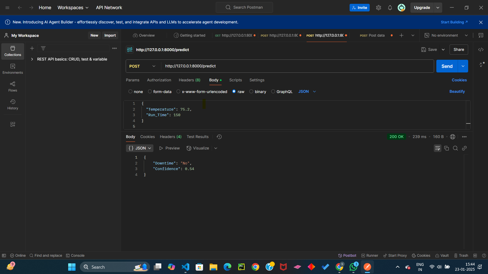
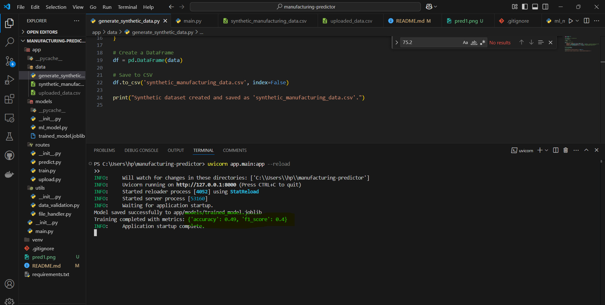

# Manufacturing Downtime Prediction API

This is an API built with FastAPI that predicts machine downtime or production defects based on input features. The model is trained and saved using Joblib, and it can be queried via a RESTful API for predictions.

## Working APIs images

 
 


## Requirements

pip install -r requirements.txt
uvicorn app.main:app --reload

- Python 3.10 or higher
- FastAPI
- Uvicorn
- scikit-learn
- joblib
- pandas
- numpy

## Setup Instructions

Follow these steps to set up and run the API on your local machine:

### 1. Clone the Repository

```bash
git clone https://github.com/Shikharcodes13/predictivemanufacturing
cd manufacturing-downtime-prediction
